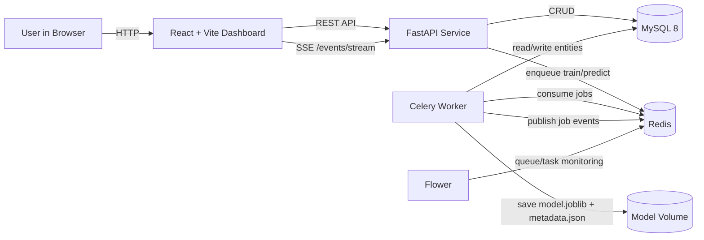

# PAaaS (Predictive Analytics as a Service)

End-to-end machine learning platform with a FastAPI backend, asynchronous Celery workers, MySQL persistence, and a React dashboard for dataset management, model training, and prediction serving.

## 🚀 Overview

👉 **Live Demo:** https://predictive-analytics-as-a-service.vercel.app

PAaaS (Predictive Analytics as a Service) is a production-style machine learning platform that enables users to manage datasets, train models asynchronously, and deploy predictions through a scalable backend architecture.

The system mimics real-world ML infrastructure used in industry, combining API services, background workers, and a full frontend dashboard.

## 🎯 Real-World Relevance

This project reflects how modern ML systems are built in production:

- Decoupled API and training pipelines
- Asynchronous task processing (Celery)
- Model lifecycle management
- Explainability integration (SHAP, LIME)
- Scalable service architecture

It demonstrates practical ML engineering beyond notebook-based workflows.

## ⚙️ Key Engineering Challenges

- Designing asynchronous ML training pipelines
- Handling dataset versioning and schema inference
- Managing model lifecycle and production promotion
- Integrating explainability tools into prediction workflows
- Ensuring consistency between API, workers, and database state

## 🚧 Future Improvements

- Implement full job orchestration API
- Add role-based authentication and permissions
- Improve monitoring and alerting for ML pipelines

## 🌐 Live Demo (Deployed Version)

👉 **Try it here:** https://predictive-analytics-as-a-service.vercel.app  
⚠️ First request may take 30–60 seconds due to backend cold start.

A simplified version of PAaaS is deployed on Vercel (frontend) and Render (backend + PostgreSQL). It is intentionally stripped down to fit within free-tier constraints, so there are a few things worth knowing before using it.

**Expect some latency.** Render's free tier spins down idle web services after a period of inactivity. The first request after the service has been idle can take 30–60 seconds while the instance cold-starts. Subsequent requests are usually much faster.

**Training is slower than in the full version.** In the full architecture, training is handled by a pool of dedicated Celery workers running in parallel processes. In the deployed demo version, there are no separate workers — the API runs training directly in a background thread within the same service. This means training shares CPU resources with the web server, so long-running jobs can be slower than they would be in the full setup.

**There is no real-time push.** The full version streams training progress to the browser over a live connection using Server-Sent Events (SSE) via Redis pub/sub. The deployed version does not use Redis, so the frontend falls back to polling the server every two seconds instead. Progress updates therefore appear in small steps rather than continuously.

**Uploaded datasets are stored in the database.** Free-tier hosting platforms use ephemeral container filesystems, so files written to disk may disappear when the service restarts or redeploys. To work around this, uploaded CSV files are stored as text directly in PostgreSQL instead of on disk. This allows datasets to survive restarts. For large files this would not be ideal, but for demo-scale datasets it is acceptable.

**Trained models do not survive restarts.** Model files (`.joblib`) are still written to the container's temporary filesystem. If the Render instance restarts, previously trained models can no longer be loaded for prediction. In that case, the model must be trained again to generate a fresh artifact.

**Please clean up after testing.** The demo runs on a shared database with limited storage. If you upload your own dataset, please delete it afterwards using the delete option in the dataset list to keep the demo usable for others.

---

## System Architecture



## Frontend Flow (Screenshots)

### 1. Overview dashboard


### 2. Models table and model lifecycle


### 3. Training workflow


### 4. Column analysis and profiling


## End-to-End Workflow

1. Create a dataset via `/dataset`.
2. Upload a CSV as a dataset version via `/datasetVersion` (profile + schema are inferred).
3. Create an ML problem via `/problem` (target + task).
4. Trigger training via `/train` (Celery async task).
5. Set production model via `/model/{model_id}/set_production`.
6. Trigger prediction via `/predict` using CSV, URI, or JSON payload.
7. Track async progress via `/celery/{task_id}` and live events on `/events/stream`.

## Tech Stack

| Layer      | Technologies                                                 |
| ---------- | ------------------------------------------------------------ |
| Frontend   | React 19, TypeScript, Vite, Tailwind CSS, Radix UI, Recharts |
| API        | FastAPI, Pydantic                                            |
| Async Jobs | Celery, Redis, Flower                                        |
| Data/DB    | MySQL 8, PyMySQL                                             |
| ML         | scikit-learn, XGBoost, SHAP, LIME, pandas, numpy             |
| Packaging  | `pyproject.toml`, editable installs                          |
| CI         | GitHub Actions (`pytest`, Docker image build)                |

## Repository Layout

```text
.
|- docker-compose.yml
|- DockerfileApi
|- DockerfileWorker
|- DockerfileFrontend
|- frontend/                 # React dashboard (Vite + TypeScript)
|  |- src/
|  |  |- components/         # UI and feature components
|  |  |- pages/              # route-level pages
|  |  |- layouts/            # dashboard shell/layout
|  |  |- routes/             # router definitions
|  |  |- lib/actions/        # API client/action layer
|  |  |- hooks/              # frontend hooks
|  |- public/                # static assets
|  |- package.json
|- src/
|  |- api/                   # FastAPI routes
|  |- worker/                # Celery tasks
|  |- celery_handler/        # Celery app config
|  |- db/                    # MySQL schema + DB access layer
|  |- mlcore/                # Training, prediction, profiling, explainability
|- docs/                     # System diagrams
|- testdata/                 # Demo/test CSVs and fixtures
```

## Quick Start (Docker Compose)

### Prerequisites

- Docker Desktop (or Docker Engine + Compose plugin)

### Start All Services

```bash
docker compose up -d --build
```

Optional: run 3 workers explicitly.

```bash
docker compose up -d --build --scale worker=3
```

### Stop Services

```bash
docker compose down
```

### Reset Everything (including volumes)

```bash
docker compose down -v
```

## Service Endpoints

- Frontend: `http://localhost:3000`
- API: `http://localhost:42000`
- OpenAPI docs: `http://localhost:42000/docs`
- Flower: `http://localhost:5555`
- MySQL: `localhost:3306`

Default database credentials (from `docker-compose.yml`):

- DB: `team1_db`
- User: `team1_user`
- Password: `team1_pass`
- Root password: `safe123`

## Local Development

### Backend (without Docker API/Worker containers)

Run MySQL + Redis first (recommended via Docker):

```bash
docker compose up -d db redis_server
```

Install dependencies:

```bash
python -m venv .venv
. .venv/bin/activate  # Linux/macOS
pip install -e '.[dev,test]'
```

PowerShell activation:

```powershell
.\.venv\Scripts\Activate.ps1
```

Set source path and run API:

```bash
export PYTHONPATH=src
uvicorn api.main:app --reload --host 0.0.0.0 --port 42000
```

Run worker:

```bash
export PYTHONPATH=src
celery -A worker.tasks worker --loglevel=info
```

PowerShell env variable form:

```powershell
$env:PYTHONPATH = "src"
```

### Frontend

```bash
cd frontend
npm install
npm run dev
```

Configure API URL if needed:

```bash
VITE_API_URL=http://localhost:42000
```

## API Surface (Selected)

### Dataset lifecycle

- `POST /dataset`
- `GET /datasets`
- `POST /datasetVersion` (multipart CSV upload)
- `GET /datasetVersion/{id}`

### ML lifecycle

- `POST /problem`
- `POST /train`
- `GET /problemModels/{problem_id}`
- `PATCH /model/{model_id}/set_production`

### Prediction lifecycle

- `POST /predict`
- `GET /modelPredictions/{model_id}`
- `GET /problemPredictions/{problem_id}`

### Monitoring and dashboard

- `GET /celery/{task_id}`
- `GET /events/stream` (SSE)
- `GET /dashboard/stats`

## Testing

Run all tests:

```bash
python -m pytest
```

Run DB smoke test only:

```bash
python -m pytest -q src/db/test_smoke.py -s
```

## Module Docs

- [Frontend README](frontend/README.md)
- [Database README](src/db/README.md)
- [ML I/O README](src/mlcore/io/README.md)

## Known Gaps

- `jobs` API endpoints exist but are currently placeholders.
- Frontend jobs page is scaffolded and not fully wired.
- Role-based auth/permission checks are not yet implemented.

## License

MIT (see [LICENSE](LICENSE)).
