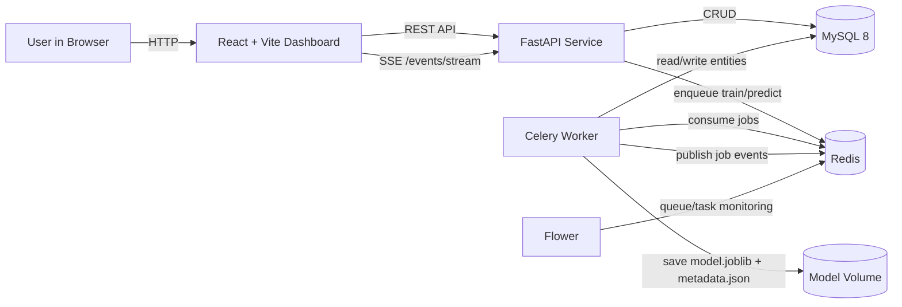
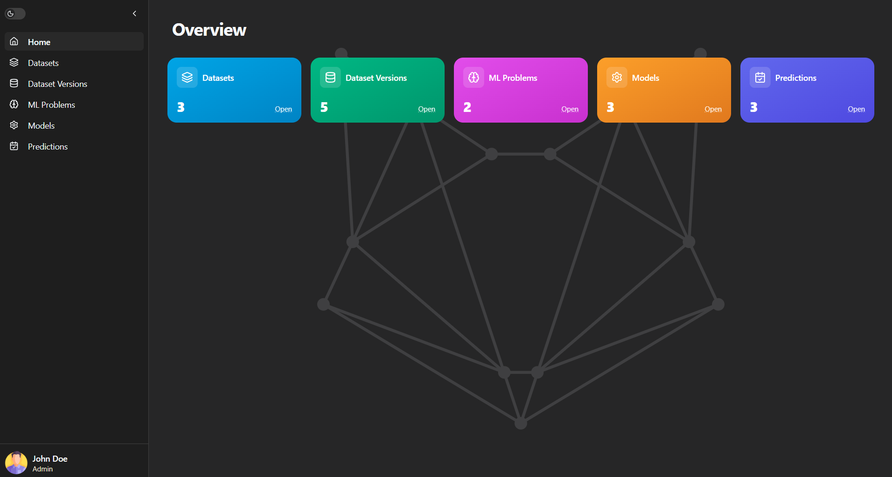
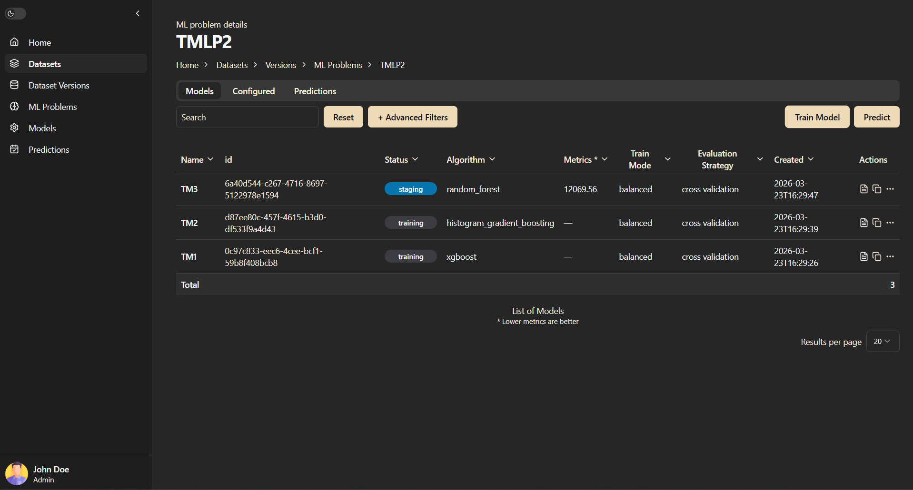
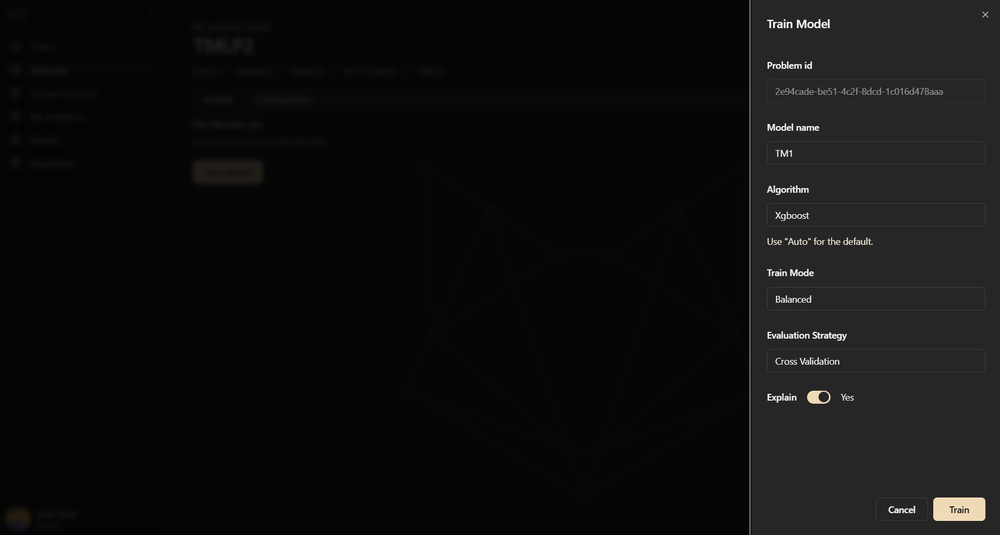
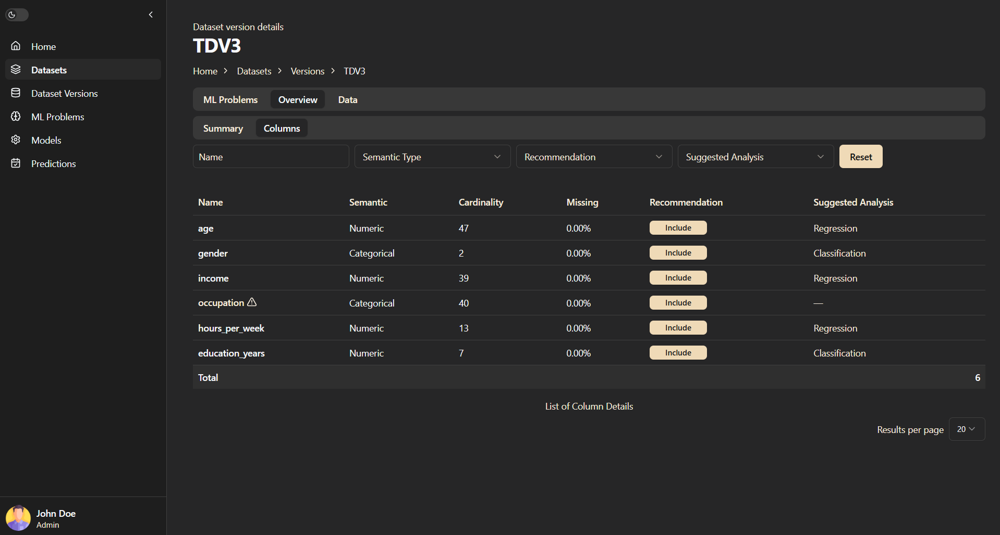

# PAaaS (Predictive Analytics as a Service)

End-to-end machine learning platform with a FastAPI backend, asynchronous Celery workers, MySQL persistence, and a React dashboard for dataset management, model training, and prediction serving.

## 🚀 Overview

👉 **Live Demo:** https://predictive-analytics-as-a-service.vercel.app

PAaaS (Predictive Analytics as a Service) is a production-style machine learning platform that enables users to manage datasets, train models asynchronously, and deploy predictions through a scalable backend architecture.

The system mimics real-world ML infrastructure used in industry, combining API services, background workers, and a full frontend dashboard.

## 🎯 Real-World Relevance

This project reflects how modern ML systems are built in production:

- Decoupled API and training pipelines
- Asynchronous task processing (Celery)
- Model lifecycle management
- Explainability integration (SHAP)
- Scalable service architecture

It demonstrates practical ML engineering beyond notebook-based workflows.

## ⚙️ Key Engineering Challenges

- Designing asynchronous ML training pipelines
- Handling dataset versioning and schema inference
- Managing model lifecycle and production promotion
- Integrating explainability tools into prediction workflows
- Ensuring consistency between API, workers, and database state

## 🚧 Future Improvements

- Implement full job orchestration API
- Add role-based authentication and permissions
- Improve monitoring and alerting for ML pipelines

## 🌐 Live Demo (Deployed Version)

👉 **Try it here:** https://predictive-analytics-as-a-service.vercel.app  
⚠️ First request may take 30–60 seconds due to backend cold start.

A simplified version of PAaaS is deployed on Vercel (frontend) and Render (backend + PostgreSQL). It is intentionally stripped down to fit within free-tier constraints, so there are a few things worth knowing before using it.

**Expect some latency.** Render's free tier spins down idle web services after a period of inactivity. The first request after the service has been idle can take 30–60 seconds while the instance cold-starts. Subsequent requests are usually much faster.

**Training is slower than in the full version.** In the full architecture, training is handled by a pool of dedicated Celery workers running in parallel processes. In the deployed demo version, there are no separate workers — the API runs training directly in a background thread within the same service. This means training shares CPU resources with the web server, so long-running jobs can be slower than they would be in the full setup.

**There is no real-time push.** The full version streams training progress to the browser over a live connection using Server-Sent Events (SSE) via Redis pub/sub. The deployed version does not use Redis, so the frontend falls back to polling the server every two seconds instead. Progress updates therefore appear in small steps rather than continuously.

**Uploaded datasets are stored in the database.** Free-tier hosting platforms use ephemeral container filesystems, so files written to disk may disappear when the service restarts or redeploys. To work around this, uploaded CSV files are stored as text directly in PostgreSQL instead of on disk. This allows datasets to survive restarts. For large files this would not be ideal, but for demo-scale datasets it is acceptable.

**Trained models do not survive restarts.** Model files (`.joblib`) are still written to the container's temporary filesystem. If the Render instance restarts, previously trained models can no longer be loaded for prediction. In that case, the model must be trained again to generate a fresh artifact.

**Please clean up after testing.** The demo runs on a shared database with limited storage. If you upload your own dataset, please delete it afterwards using the delete option in the dataset list to keep the demo usable for others.

---

## System Architecture



## Frontend Flow (Screenshots)

### 1. Overview dashboard



### 2. Models table and model lifecycle



### 3. Training workflow



### 4. Column analysis and profiling



## End-to-End Workflow

1. Create a dataset via `/dataset`.
2. Upload a CSV as a dataset version via `/datasetVersion` (profile + schema are inferred).
3. Create an ML problem via `/problem` (target + task).
4. Trigger training via `/train` (Celery async task).
5. Set production model via `/model/{model_id}/set_production`.
6. Trigger prediction via `/predict` using CSV, URI, or JSON payload.
7. Track async progress via `/celery/{task_id}` and live events on `/events/stream`.

---

## ML Pipeline

### Algorithm Presets

PAaaS ships with a set of algorithm presets per task type, loaded dynamically from `src/mlcore/presets/`. Each preset exports a `build_model()` function that returns a scikit-learn `Pipeline` and a metadata dict. You select a preset when triggering a training job.

**Classification presets**

| Preset | Algorithm |
|---|---|
| `auto` | Evaluates LogisticRegression, RandomForest, ExtraTrees, XGBoost via CV and picks the best |
| `logistic_regression` | Logistic Regression |
| `random_forest` | Random Forest Classifier |
| `extra_trees` | Extra Trees Classifier |
| `histogram_gradient_boosting` | HistGradientBoosting Classifier |
| `xgboost` | XGBoost Classifier |

**Regression presets**

| Preset | Algorithm |
|---|---|
| `auto` | Evaluates LinearRegression, Ridge, RandomForest, XGBoost via CV and picks the best |
| `linear_regression` | Linear Regression |
| `linear_ridge_regression` | Ridge Regression |
| `polynomial_ridge_regression` | Polynomial features + Ridge Regression |
| `random_forest` | Random Forest Regressor |
| `histogram_gradient_boosting` | HistGradientBoosting Regressor |
| `xgboost` | XGBoost Regressor |

The `auto` preset runs all candidate models through cross-validation and selects the best by `f1_macro` (classification) or `r2` (regression). The winning estimator is stored alongside its identity in the model metadata so you always know which algorithm was chosen.

Use `GET /presets/{task}` to retrieve the available preset names for a given task at runtime.

### Train Mode

Controls the number of cross-validation folds used during candidate evaluation and training:

| Mode | CV Folds | Use case |
|---|---|---|
| `fast` | 3 | Quick iteration during exploration |
| `balanced` | 5 | Default; good accuracy/speed trade-off |
| `accurate` | 5 | Same folds as balanced, stricter selection criteria |

### Evaluation Strategy

- **`cv`** — runs StratifiedKFold (classification) or KFold (regression) on the training set, then also evaluates on a holdout test split. Returns both CV mean/std and test-set metrics.
- **`holdout`** — skips cross-validation and evaluates on the test split only. Faster, but no variance estimate.

### Metrics

| Task | Metrics computed |
|---|---|
| Classification | accuracy, precision (macro), recall (macro), f1 (macro) |
| Regression | MAE, MSE, RMSE, R², MAPE |

All metrics are stored in the model record and displayed in the dashboard.

### Column Profiling

When a CSV is uploaded, `mlcore/profile/profiler.py` analyses each column and infers:

- **Semantic type:** `numeric`, `categorical`, `boolean`, `datetime`, or `unknown`
- **Analysis suggestion:** `classification`, `regression`, or `none` — based on cardinality heuristics (unique-value ratio, top-3-value coverage)
- **Exclusion reason** (if applicable): `constant`, `empty`, `id_like`, `datetime`, `unsupported_dtype`, `high_cardinality`

ID-like columns — numeric sequences where nearly every value is unique — are detected automatically and excluded from feature selection. The profiler also reports per-column missing-value percentage and basic statistics (min/max/mean/std for numeric; top value + frequency for categorical).

### Feature Strategy

By default the trainer uses the profiler's exclusion suggestions to pick features (`"auto"`). Users can override this:

- `PATCH /problem/{problem_id}/feature_strategy` — supply explicit `include` or `exclude` column lists
- `POST /problem/{problem_id}/feature_strategy/reset` — revert to `auto`

### Explainability

After training, the system computes SHAP values using `TreeExplainer`:

- **Background samples:** up to 200 rows sampled from training data
- **Explanation samples:** up to 500 rows sampled from the test set
- **Global importance:** mean absolute SHAP values per feature, with quantile distributions (10th, 25th, 50th, 75th, 90th percentile)
- **Feature tracking:** post-OneHotEncoding feature names are mapped back to their original column names for display in the dashboard

> **Note:** LIME is a listed dependency but is not currently integrated into the explainability pipeline. Only SHAP is used.

---

## Deployment Modes

PAaaS supports two runtime modes, controlled by the `APP_MODE` environment variable. This is the primary switch between the full local/production setup and the lightweight deployed version.

| | Full mode | Portfolio mode |
|---|---|---|
| `APP_MODE` | `full` | `portfolio` |
| Database | MySQL 8 | PostgreSQL (via `DATABASE_URL`) |
| Task queue | Celery + Redis (3 workers by default) | None |
| Training execution | Async via Celery workers | Sync in FastAPI thread pool (max 2) |
| Progress updates | SSE via Redis pub/sub | HTTP polling every 2 s |
| CSV storage | Local filesystem (`UPLOAD_DIR`) | Stored as text in the database |
| Model artifacts | Shared Docker volume (`/models`) | Ephemeral (`/tmp/models`) |

The live demo runs in portfolio mode. See the [Live Demo](#-live-demo-deployed-version) section above for the practical implications.

---

## Tech Stack

| Layer      | Technologies                                                 |
| ---------- | ------------------------------------------------------------ |
| Frontend   | React 19, TypeScript, Vite, Tailwind CSS, Radix UI, Recharts |
| API        | FastAPI, Pydantic                                            |
| Async Jobs | Celery, Redis, Flower                                        |
| Data/DB    | MySQL 8 (full) / PostgreSQL (portfolio), PyMySQL / psycopg2  |
| ML         | scikit-learn, XGBoost, SHAP, pandas, numpy                   |
| Packaging  | `pyproject.toml`, editable installs                          |
| CI         | GitHub Actions (`pytest`, Docker image build)                |

## Repository Layout

```text
.
|- docker-compose.yml
|- DockerfileApi
|- DockerfileWorker
|- DockerfileFrontend
|- frontend/                 # React dashboard (Vite + TypeScript)
|  |- src/
|  |  |- components/         # UI and feature components
|  |  |- pages/              # route-level pages
|  |  |- layouts/            # dashboard shell/layout
|  |  |- routes/             # router definitions
|  |  |- lib/actions/        # API client/action layer
|  |  |- hooks/              # frontend hooks
|  |- public/                # static assets
|  |- package.json
|- src/
|  |- api/                   # FastAPI routes
|  |- worker/                # Celery tasks
|  |- celery_handler/        # Celery app config
|  |- db/                    # MySQL schema + DB access layer
|  |- mlcore/                # Training, prediction, profiling, explainability
|  |  |- presets/            # Algorithm presets (classification/ + regression/)
|  |  |- profile/            # Column profiler and schema inference
|  |  |- train/              # Training orchestration
|  |  |- predict/            # Prediction and input validation
|  |  |- metrics/            # Test-set and cross-validation metrics
|  |  |- explain/            # SHAP explainability
|  |  |- io/                 # CSV I/O, artifact save/load, preset loader
|- docs/                     # System diagrams and screenshots
|- testdata/                 # Demo/test CSVs and fixtures
```

## Quick Start (Docker Compose)

### Prerequisites

- Docker Desktop (or Docker Engine + Compose plugin)

### Start All Services

```bash
docker compose up -d --build
```

The Compose file starts **3 Celery worker replicas by default**. To override the count explicitly:

```bash
docker compose up -d --build --scale worker=3
```

### Stop Services

```bash
docker compose down
```

### Reset Everything (including volumes)

```bash
docker compose down -v
```

## Service Endpoints

- Frontend: `http://localhost:3000`
- API: `http://localhost:42000`
- OpenAPI docs: `http://localhost:42000/docs`
- Flower: `http://localhost:5555`
- MySQL: `localhost:3306`

Default database credentials (from `docker-compose.yml`):

- DB: `team1_db`
- User: `team1_user`
- Password: `team1_pass`
- Root password: `safe123`

## Configuration

### Environment Variables

| Variable | Services | Default | Purpose |
|---|---|---|---|
| `APP_MODE` | api, worker | `full` | Runtime mode: `full` (MySQL + Celery) or `portfolio` (PostgreSQL, sync training) |
| `PYTHONPATH` | local dev | — | Must be set to `src` for all Python commands |
| `VITE_API_URL` | frontend | `http://localhost:42000` | Backend URL |
| `VITE_PROGRESS_MODE` | frontend | `sse` | `sse` for live events or `poll` for HTTP polling (portfolio) |
| `REDISSERVER` | api, worker | — | Redis connection URL (full mode only) |
| `DB_HOST` / `DB_PORT` / `DB_NAME` / `DB_USER` / `DB_PASS` | api, worker | — | MySQL connection parameters (full mode) |
| `DATABASE_URL` | api, worker | — | PostgreSQL connection string (portfolio mode) |
| `MODEL_BASE_PATH` | api, worker | `/models` | Where `.joblib` model artifacts are written |
| `UPLOAD_DIR` | api | — | Where uploaded CSVs are stored on disk (full mode) |
| `ALLOWED_ORIGINS` | api | — | Comma-separated CORS origin allowlist |
| `SEED_TEST_DATA` | api | — | Set to `true` to auto-seed demo data on startup |
| `DELAY_DB_CONN_ON_STARTUP` | api | `0` | Seconds to wait before DB initialisation (prevents Docker startup race conditions) |
| `PYTEST_CI_MODE` | tests | — | Set to `True` in CI to skip smoke tests that require a live database |

The database schema is applied automatically on API startup — no manual migration step is needed.

## Local Development

### Backend (without Docker API/Worker containers)

Run MySQL + Redis first (recommended via Docker):

```bash
docker compose up -d db redis_server
```

Install dependencies:

```bash
python -m venv .venv
. .venv/bin/activate  # Linux/macOS
pip install -e '.[dev,test]'
```

PowerShell activation:

```powershell
.\.venv\Scripts\Activate.ps1
```

Set source path and run API:

```bash
export PYTHONPATH=src
uvicorn api.main:app --reload --host 0.0.0.0 --port 42000
```

Run worker:

```bash
export PYTHONPATH=src
celery -A worker.tasks worker --loglevel=info
```

PowerShell env variable form:

```powershell
$env:PYTHONPATH = "src"
```

### Frontend

```bash
cd frontend
npm install
npm run dev
```

Configure API URL if needed:

```bash
VITE_API_URL=http://localhost:42000
```

## API Surface

### Dataset lifecycle

- `POST /dataset`
- `GET /datasets`
- `POST /datasetVersion` (multipart CSV upload)
- `GET /datasetVersion/{id}`
- `GET /datasetVersionsAll` — all versions with dataset info joined
- `PATCH /datasetVersion/{version}/exclude_suggestions` — override profiler column exclusions
- `POST /datasetVersion/{version}/profile` — trigger manual profile recalculation
- `GET /datasetVersionProblems/{dataset_version_id}` — problems linked to a version

### ML lifecycle

- `POST /problem`
- `GET /mlProblemsAll`
- `POST /train`
- `GET /problemModels/{problem_id}`
- `GET /modelsAll`
- `PATCH /model/{model_id}/set_production`
- `PATCH /problem/{problem_id}/feature_strategy` — set custom include/exclude column lists
- `POST /problem/{problem_id}/feature_strategy/reset` — revert feature strategy to `auto`
- `GET /presets/{task}` — list available algorithm presets for a task type

### Prediction lifecycle

- `POST /predict` (accepts CSV upload, URI, or JSON payload)
- `GET /modelPredictions/{model_id}`
- `GET /problemPredictions/{problem_id}`
- `GET /predictionsAll`

### Monitoring and dashboard

- `GET /celery/{task_id}`
- `GET /events/stream` (SSE)
- `GET /dashboard/stats`
- `GET /health` — returns service status, mode, database, and storage info

## Testing

Run all tests:

```bash
python -m pytest
```

Run DB smoke test only:

```bash
python -m pytest -q src/db/test_smoke.py -s
```

## Module Docs

- [Frontend README](frontend/README.md)
- [Database README](src/db/README.md)
- [ML I/O README](src/mlcore/io/README.md)

## Known Gaps

- `jobs` API endpoints exist but are currently placeholders.
- Frontend jobs page is scaffolded and not fully wired.
- Role-based auth/permission checks are not yet implemented.
- LIME is a listed dependency but is not integrated — SHAP is the only active explainability backend.
- `timeseries` is a valid task type in the database schema but has no corresponding ML pipeline implementation; only `classification` and `regression` are functional.

## License

MIT (see [LICENSE](LICENSE)).
