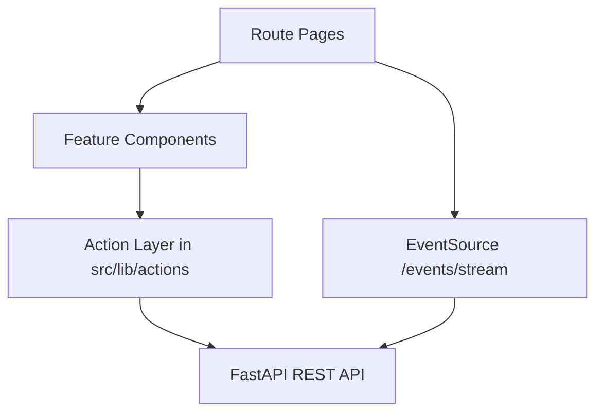

# Frontend Dashboard

React + TypeScript dashboard for managing the PAaaS machine learning lifecycle: datasets, dataset versions, ML problems, models, and predictions.

## Highlights

- Full CRUD UI for datasets, versions, problems, models, and predictions.
- Live job updates using Server-Sent Events (`/events/stream`).
- Table filtering, sorting, and pagination across entity pages.
- Explainability views for trained models.
- Responsive layout with theme support.

## Stack

- React 19
- TypeScript
- Vite
- Tailwind CSS
- Radix UI primitives
- React Router
- React Hook Form + Zod
- Recharts

## Frontend Architecture



## Routes

Main route tree defined in `src/routes/index.tsx`:

- `/` -> landing/app page
- `/dashboard` -> overview
- `/dashboard/datasets`
- `/dashboard/datasets/:datasetId`
- `/dashboard/datasets/:datasetId/:datasetVersionId`
- `/dashboard/datasets/:datasetId/:datasetVersionId/:problemId`
- `/dashboard/datasets/:datasetId/:datasetVersionId/:problemId/:modelId`
- `/dashboard/datasets/:datasetId/:datasetVersionId/:problemId/:modelId/:predictionId`
- `/dashboard/dataset-versions`
- `/dashboard/ml-problems`
- `/dashboard/models`
- `/dashboard/predictions`
- `/dashboard/jobs`

## Project Structure

```text
frontend/
|- src/
|  |- components/        # UI + feature components
|  |- pages/             # route-level pages
|  |- routes/            # router config
|  |- layouts/           # dashboard shell
|  |- lib/actions/       # API calls and DTO handling
|  |- hooks/             # custom hooks
|  |- main.tsx           # app bootstrap
|- public/               # static assets
|- package.json
```

## API Configuration

The frontend reads API base URL from `VITE_API_URL`.

Default fallback in action modules is:

```text
http://localhost:42000
```

Create `frontend/.env.local` if needed:

```bash
VITE_API_URL=http://localhost:42000
```

## Run Locally

```bash
cd frontend
npm install
npm run dev
```

Local app URL (Vite):

- `http://localhost:5173`

## Production Build

```bash
cd frontend
npm run build
npm run preview
```

## Dockerized Frontend

The repository includes `DockerfileFrontend` and Compose service `frontend`.

From repo root:

```bash
docker compose up -d --build frontend api
```

Frontend URL:

- `http://localhost:3000`

## Quality Commands

```bash
cd frontend
npm run lint
npm run build
```

## Live Events in UI

SSE listeners are implemented in pages such as:

- `src/pages/dashboard/models/ModelsPage.tsx`
- `src/pages/dashboard/models/ModelDetailPage.tsx`
- `src/pages/dashboard/predictions/PredictionsPage.tsx`
- `src/pages/dashboard/ml_problems/MLProblemDetailPage.tsx`

They subscribe to `GET /events/stream` and react to published `job.completed` / `job.failed` events.

## Notes

- Jobs page exists as scaffold (`/dashboard/jobs`) but is not fully wired in the current navigation.
- Most data access is centralized in `src/lib/actions/*` for easier API evolution.
