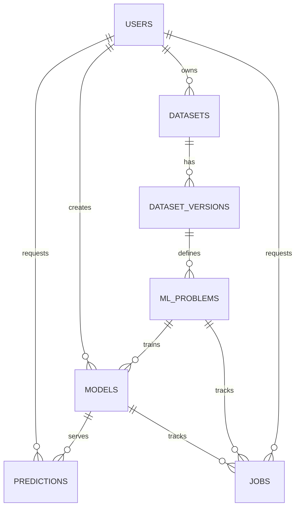

# Database Module (`src/db`)

MySQL schema, initialization scripts, and Python data-access layer for the PAaaS platform.

## Responsibilities

- Define relational schema for datasets, ML problems, models, jobs, and predictions.
- Provide CRUD and query helpers used by FastAPI endpoints.
- Provide local initialization, smoke testing, and test DB seeding utilities.

## Data Model



Schema source: `src/db/schema_mysql.sql`

## Files

- `schema_mysql.sql`: table definitions.
- `seed.sql`: optional local seed/self-test script.
- `db.py`: DB helper functions (CRUD, pagination/filtering, joined views, production model switching).
- `init_db.py`: applies schema (and optional seed).
- `init_test_db.py`: creates/populates `team1_db_test`.
- `test_smoke.py`: smoke test for end-to-end DB helper flow.

## Connection Configuration

Environment variables used by DB scripts/helpers:

| Variable | Default |
| --- | --- |
| `DB_HOST` | `127.0.0.1` |
| `DB_PORT` | `3306` |
| `DB_NAME` | `team1_db` |
| `DB_USER` | `team1_user` |
| `DB_PASS` | `team1_pass` |
| `MODEL_BASE_PATH` | `/models` |

## Quick Start

### 1. Start MySQL

From repository root:

```bash
docker compose up -d db
```

### 2. Initialize Schema

```bash
python -m src.db.init_db
```

This applies `schema_mysql.sql` with `CREATE TABLE IF NOT EXISTS` statements.

## Local Reset Workflow

If you changed schema columns and need a clean reset:

```sql
SET FOREIGN_KEY_CHECKS=0;
DROP TABLE IF EXISTS predictions;
DROP TABLE IF EXISTS jobs;
DROP TABLE IF EXISTS models;
DROP TABLE IF EXISTS ml_problems;
DROP TABLE IF EXISTS dataset_versions;
DROP TABLE IF EXISTS datasets;
DROP TABLE IF EXISTS users;
SET FOREIGN_KEY_CHECKS=1;
```

Then re-run:

```bash
python -m src.db.init_db
```

## Test Database Workflow (`team1_db_test`)

Create and seed test DB with one representative row per table:

```bash
python -m src.db.init_test_db --reset
```

Custom input fixture:

```bash
python -m src.db.init_test_db --input src/db/test_db.txt --reset
```

## Smoke Test

Run DB smoke tests:

```bash
python -m pytest -q src/db/test_smoke.py -s
```

Notes:

- Smoke tests are skipped when `PYTEST_CI_MODE=True`.
- Smoke tests are skipped automatically if MySQL is unreachable.

## Query Features in `db.py`

`db.py` provides:

- CRUD for datasets, dataset versions, ML problems, models, jobs, predictions.
- Pagination + sorting + filtering for list endpoints.
- Joined queries for dashboard-style views:
  - `get_dataset_versions_all_joined`
  - `get_ml_problems_all_joined`
  - `get_models_all_joined`
  - `get_predictions_all_joined`
  - `get_ml_predictions_all_joined`
- Transactional production switch with row lock:
  - `set_model_to_production(problem_id, model_id)`

## Troubleshooting

### MySQL container name conflict

If Docker reports a conflict for an old container name:

```bash
docker rm fachpraktikum-mysql
```

Then restart DB service:

```bash
docker compose up -d db
```

### Access denied / cannot create `team1_db_test`

Create DB once with root credentials:

```bash
mysql -h 127.0.0.1 -P 3306 -u root -psafe123 -e "CREATE DATABASE IF NOT EXISTS team1_db_test;"
mysql -h 127.0.0.1 -P 3306 -u root -psafe123 -e "GRANT ALL PRIVILEGES ON team1_db_test.* TO 'team1_user'@'%'; FLUSH PRIVILEGES;"
```

### Python cannot import `src.db`

Run commands from repo root and ensure your interpreter sees project root or `src`.
